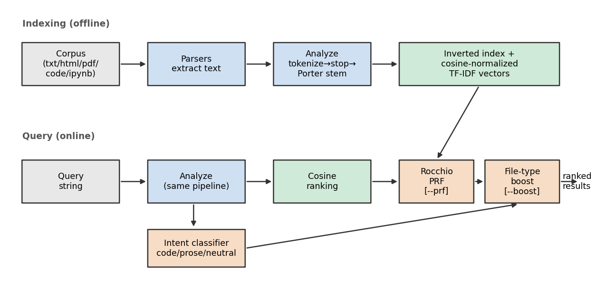
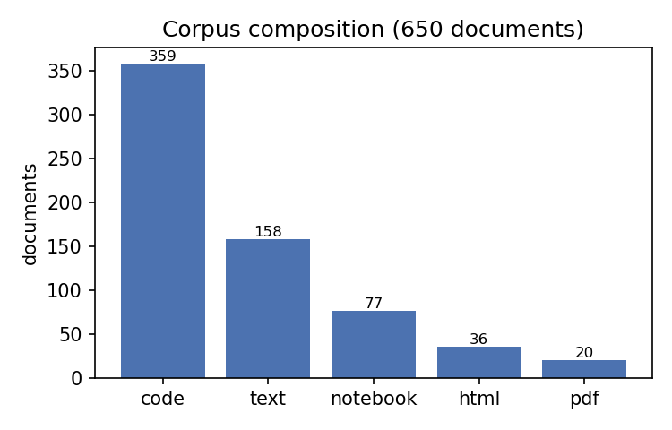
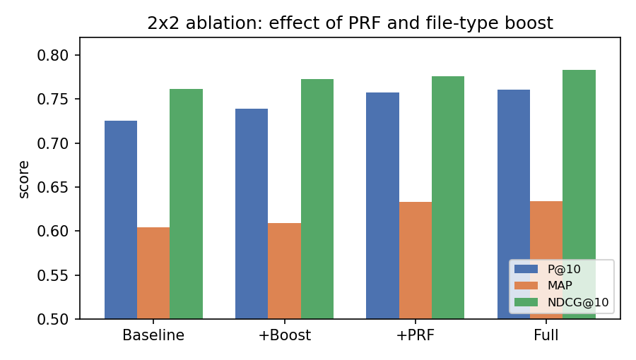
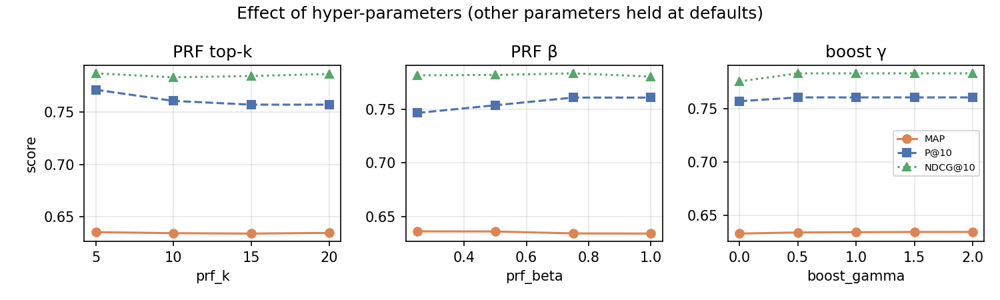

# Content-Based Local File Search Across Heterogeneous File Types with Query-Conditioned File-Type Boosting and Pseudo-Relevance Feedback

**William Berthouex, Noah Sleeman** — Team *Can't Recall*
CSC 575: Intelligent Information Retrieval, Spring 2025–26

> **Draft for the team to adapt into the required IEEE/ACM two-column template.**
> All numbers, tables and figures are generated by the code in this repository
> (`python -m evaluation.evaluate` and `python -m report.make_figures`). Review,
> verify, and rewrite in your own voice before submission.

---

## Abstract

We present a command-line search engine that retrieves the most relevant files
from a local directory containing a mix of file types — prose, web pages, PDFs,
source code, and Jupyter notebooks. The system is built on a classic vector-space
model (an inverted index with cosine-normalized TF-IDF weights) implemented from
scratch, and adds two advanced components: (1) a *query-conditioned file-type
boost* that re-weights documents according to a rule-based classification of the
query's intent (code, prose, or neutral), and (2) Rocchio *pseudo-relevance
feedback* (PRF). We evaluate on a 650-document corpus assembled from Project
Gutenberg, Wikipedia, arXiv, and GitHub, using 28 queries whose relevance
judgements derive from document provenance rather than text. A 2×2 ablation shows
that both components improve every metric: PRF is the dominant contributor,
raising MAP from 0.604 to 0.633, while the file-type boost adds a small but
consistent gain; the full system reaches P@10 = 0.761 and NDCG@10 = 0.783, and a
grid search improves MAP to 0.638. We discuss where each component helps and where
PRF causes query drift.

**Keywords:** information retrieval, vector-space model, TF-IDF, pseudo-relevance
feedback, file-type ranking, local file search.

---

## 1. Introduction

People accumulate large, messy local file collections that mix prose documents,
web pages, PDFs, source code, and notebooks. Operating-system file search is
dominated by filename and exact-substring matching and rarely ranks files by how
well their *content* answers a free-text information need. The goal of this
project is a content-based retrieval system for a local directory: given a
keyword query, return a ranked list of the most relevant files regardless of
their format.

Two observations motivate our design. First, retrieval quality depends on robust
text extraction and normalization *across* heterogeneous formats — the raw bytes
of an HTML page, a PDF, and a Python file look nothing alike, but their indexable
content should be treated uniformly. Second, *the relevant file type depends on
the query*: "what is a binary search tree" most plausibly wants a prose
explanation, whereas "binary search tree insert method" most plausibly wants
source code. A retrieval system that is aware of this can do better than one that
treats all file types identically.

We build a vector-space retrieval engine from scratch and layer two advanced
components on top of the TF-IDF/cosine baseline: a query-intent classifier that
drives a file-type boost, and Rocchio pseudo-relevance feedback. Both are
independently toggleable, which lets us measure each component's contribution
with a 2×2 ablation. On a 28-query benchmark over a 650-document multi-format
corpus, the full system improves MAP from 0.604 (baseline) to 0.634 (0.638 after
tuning); PRF accounts for most of the gain, while the file-type boost helps
modestly and, importantly, rarely hurts. We also document a failure mode in
which PRF drifts on broad, ambiguous queries.

## 2. Background and Related Work

The **vector-space model** represents documents and queries as weighted term
vectors and ranks by cosine similarity [1]. We use TF-IDF weighting in the SMART
`ltc` form: a logarithmic term-frequency component `1 + log10(tf)`, an inverse
document frequency component `log10(N/df)`, and L2 (cosine) normalization [2].
The **inverted index** maps each term to the documents that contain it and is the
standard structure enabling term-at-a-time scoring [2].

For preprocessing we apply the **Porter stemmer** [3], a rule-based algorithm
that strips morphological suffixes so that "connect", "connected", and
"connection" share a stem.

**Relevance feedback** improves a query using information about which results are
relevant. The **Rocchio** algorithm moves the query vector toward the centroid of
relevant documents and away from non-relevant ones [4]. **Pseudo-relevance
feedback** (PRF) automates this by assuming the top-k initial results are
relevant [2], trading the need for human judgements for the risk of *query drift*
when those assumptions are wrong.

Prior file-search research emphasizes that file retrieval benefits from context
beyond raw content — for example, Soules and Ganger use inter-file access context
to improve search [5], and Dinneen and Julien survey the broader file-management
literature [6]. Our file-type boost is a lightweight, content-only form of such
context: it conditions ranking on the *type* of file and the inferred intent of
the query.

## 3. Methodology

Figure 1 shows the architecture, which has an offline indexing pipeline and an
online query pipeline that share the same text analyzer and vector space.



*Figure 1. Offline indexing (top) and online query processing (bottom). The query
analyzer is identical to the document analyzer, so queries and documents live in
the same TF-IDF space. PRF and the file-type boost are optional stages.*

### 3.1 Text extraction

Each file type is converted to plain text by a dedicated parser
(`explorer/ir/parsers.py`): HTML is stripped of tags and `<script>/<style>`
content with BeautifulSoup; Jupyter notebooks are parsed as JSON and their
markdown and code cell sources concatenated; PDFs are extracted with `pypdf`;
text, markdown, and source-code files are read directly. Each file is also mapped
to a coarse **file category** — `text`, `markdown`, `html`, `pdf`, `notebook`, or
`code` — used later by the boost.

We use existing libraries for this routine format handling — BeautifulSoup
(HTML), `pypdf` (PDF) and NLTK (stemming, Section 3.2) — but implement the
retrieval components themselves (index, weighting, ranking, intent, boost,
feedback, metrics) directly.

### 3.2 Preprocessing

The analyzer (`preprocess.py`) lowercases input, tokenizes on alphanumeric/
underscore runs (so identifiers such as `read_save_data` survive), removes a
standard English stopword list, and applies NLTK's Porter stemmer. The
*same* analyzer is applied to documents at index time and to queries at search
time, which keeps the vector space consistent.

### 3.3 Indexing and weighting

We build an inverted index `term → {doc_id : tf}` and document frequencies `df`.
At finalization we compute, for every document term, the `ltc` weight

```
w(t,d) = (1 + log10 tf(t,d)) · log10(N / df(t))
```

and L2-normalize each document vector. Because both document and query vectors
are normalized, **cosine similarity is the dot product**, computed term-at-a-time
over the postings lists. The same weighting is applied to the query, which means
the Rocchio centroid (Section 3.5) lives in exactly the same space. The index is
persisted as gzipped JSON storing only the raw integer postings; IDF and the
normalized vectors are recomputed on load, keeping the artifact compact.

### 3.4 Query-intent classification and file-type boost

A rule-based classifier (`intent.py`) labels each query `code`, `prose`, or
`neutral`. Code signals include programming keywords (`def`, `class`, `import`,
`malloc`, …), code punctuation (`(){};`, `::`, `->`), snake_case/camelCase
identifiers, dotted calls, and source-file extensions; prose signals include
question phrases ("what is", "how does", "explain") and a leading question word.
The query is labelled with the stronger signal, or `neutral` if neither fires.

The boost (`rank.py`) multiplies each document's cosine score by a factor that
depends on the (intent × file category) pair:

```
score'(d) = score(d) · boost[intent][category(d)] ^ gamma
```

The boost matrix is hand-tuned (e.g. for `code` intent, `code` and `notebook`
files are promoted and prose demoted; for `prose` intent the reverse), and a
single exponent `gamma` controls its strength (`gamma = 0` disables it). This is
our concrete answer to "what determines whether a file *type* is relevant to a
query."

### 3.5 Rocchio pseudo-relevance feedback

When enabled, PRF assumes the top-`k` documents of the initial ranking are
relevant and forms a new query vector

```
q' = alpha · q + (beta / k) · Σ_{d ∈ top-k} d
```

(no negative term, as is standard for *pseudo*-feedback), re-normalizes it, and
re-ranks. PRF and the boost are independent toggles, so the four ablation
variants — baseline, +boost, +PRF, full — are produced by the same code path.

## 4. Experiments and Results

### 4.1 Corpus

We assembled the corpus from public sources with a reproducible downloader
(`corpus/build_corpus.py`) to obtain a heterogeneous mix of formats: Project
Gutenberg books (`.txt`), Wikipedia articles (`.html` and `.txt`), arXiv CS
papers (`.pdf`), and source files and notebooks from popular GitHub repositories
(`.py/.java/.cpp/.h/.rs`, `.ipynb`). The collection contains 709 files, of which
650 held extractable text and were indexed (67,610 unique terms). Figure 2 shows
the composition. (The data-collection script is a one-time utility, separate from
the retrieval system, and was written with the help of an AI coding assistant;
the retrieval components evaluated here are our own work.)



*Figure 2. Indexed documents by file category (650 total).*

### 4.2 Relevance judgements (qrels)

Every downloaded file is tagged in a manifest with a **theme** derived from its
*source*, not its text (e.g. arXiv `cs.CR` papers → `cryptography`; Flask source
→ `web_framework`). A document is judged relevant to a query iff its theme is one
of the query's relevant themes. Because the labels come from provenance rather
than content, scoring does not simply reward the ranker for matching the words it
indexed. Several themes (`machine_learning`, `cryptography`, `databases`, …)
deliberately span multiple sources and file types, so "which file type is
relevant" is testable. The 28 test queries (`evaluation/queries.py`) are balanced
across prose-intent, code-intent, and neutral/mixed needs.

### 4.3 Metrics

We report Precision@10, Mean Average Precision (MAP, over the top 100), and
NDCG@10 with binary gains, all implemented from scratch (`evaluation/metrics.py`).

### 4.4 Ablation

Table 1 (and Figure 3) gives the 2×2 ablation at default hyper-parameters
(`prf_k = 10`, `beta = 0.75`, `gamma = 1.0`).

*Table 1. 2×2 ablation over 28 queries.*

| Variant              | P@10   | MAP    | NDCG@10 |
|----------------------|--------|--------|---------|
| Baseline TF-IDF      | 0.7250 | 0.6044 | 0.7618  |
| + File-type boost    | 0.7393 | 0.6089 | 0.7728  |
| + PRF                | 0.7571 | 0.6329 | 0.7758  |
| Full (PRF + boost)   | 0.7607 | 0.6342 | 0.7833  |



*Figure 3. Both components improve every metric; PRF is the dominant contributor.*

PRF alone raises MAP by 0.029 (+4.7% relative); the boost alone raises MAP by
0.005 and P@10 by 0.014. The two are roughly additive, and the full system is
best on all three metrics.

### 4.5 Hyper-parameter study

A grid search over `prf_k ∈ {5,10,15,20}`, `beta ∈ {0.25,0.5,0.75,1.0}`, and
`gamma ∈ {0,0.5,1,1.5,2}` found its best MAP (0.6382, with P@10 = 0.7893,
NDCG@10 = 0.8011) at `prf_k = 5, beta = 0.5, gamma = 2.0`. Figure 4 shows
one-dimensional sweeps with the other parameters held at their defaults.



*Figure 4. MAP peaks at small `prf_k` (≈5) and moderate `beta` (≈0.5–0.75) and
increases slightly and then saturates in the boost exponent `gamma`.*

The PRF parameters matter most: a small feedback set (`k≈5`) and moderate feedback
weight (`beta≈0.5`) maximize MAP, because larger, more aggressive feedback
introduces off-topic terms. The boost exponent has only a small, monotonically
positive effect on MAP.

### 4.6 Intent classification

The rule-based classifier agrees with the expected intent on 27 of 28 queries
(96.4%). The single error is a prose-style query
("classic english literature novels and stories") that contains no explicit
question cue and is labelled `neutral`.

### 4.7 Qualitative examples

* **Success (prose), q01 "what is cryptography and how does encryption work"**
  (intent = prose): all five top results are relevant Wikipedia `text`/`html`
  articles in both baseline and full system.
* **Success (code), q13 "flask web framework route function blueprint"**
  (intent = code): all five top results are relevant Flask `code` files; the
  boost reinforces an already-correct code ranking.
* **Improvement, q28 "deep learning for data science"** (neutral, 148 relevant):
  the baseline returns 4/5 relevant in the top five and the full system 5/5,
  drawing on notebooks and prose.
* **Failure, q20 "machine learning neural networks"** (neutral, 109 relevant):
  the baseline returns 4/5 relevant in the top five, but PRF *drops* this to 3/5.
  The top-k feedback set on this very broad query contains a few off-topic but
  lexically dense documents, pulling the query toward them (query drift).

## 5. Discussion

**What worked.** PRF is the largest single improvement and is robust across
metrics, confirming that automatic query expansion toward the top results helps
on this corpus. The from-scratch TF-IDF/cosine baseline is already strong
(P@10 ≈ 0.73, MAP ≈ 0.60), reflecting good text extraction across formats. The
intent classifier is accurate enough (96.4%) to drive the boost reliably.

**What helped less.** The file-type boost yields only a small average gain, even
as its strength parameter increases. Two reasons: (i) on this benchmark most
queries already retrieve the right file type because content and type are
correlated (code queries use code vocabulary), so there is little headroom; and
(ii) many themes are deliberately multi-type, so promoting one category cannot
help much. Its value is mainly that it almost never hurts and that it makes the
type/intent relationship explicit and controllable.

**What failed.** PRF causes query drift on broad, lexically diverse queries such
as q20, where the pseudo-relevant set is not uniformly on-topic. Smaller `prf_k`
mitigates this (consistent with the sweep in Figure 4). A per-query decision to
apply PRF, or term-limited expansion, would likely help.

**Limitations.** Relevance is binary and provenance-based, which is reproducible
but coarse (a tangentially related article counts the same as a central one).
arXiv/Wikipedia content changes over time, so exact numbers are not bit-for-bit
reproducible, though the methodology is. The intent classifier is rule-based and
English-only.

## 6. Conclusion

We built a content-based local file search engine spanning five+ file types,
combining a from-scratch TF-IDF/cosine vector-space baseline with a
query-conditioned file-type boost and Rocchio pseudo-relevance feedback. On a
650-document, 28-query benchmark, the full system improves MAP from 0.604 to
0.634 (0.638 after tuning) and reaches P@10 = 0.761 / NDCG@10 = 0.783, with PRF
the dominant contributor and the file-type boost a small, safe addition.
The most interesting finding is the asymmetry between the two advanced
components: automatic feedback is powerful but risks drift, whereas type-aware
boosting is gentle and reliable. Future work: selective/adaptive PRF to avoid
drift, learned (rather than hand-tuned) boost weights, graded relevance
judgements, and incremental indexing for live directories.

## References

[1] G. Salton, A. Wong, and C. S. Yang, "A vector space model for automatic
indexing," *Communications of the ACM*, vol. 18, no. 11, pp. 613–620, 1975.

[2] C. D. Manning, P. Raghavan, and H. Schütze, *Introduction to Information
Retrieval.* Cambridge University Press, 2008.

[3] M. F. Porter, "An algorithm for suffix stripping," *Program*, vol. 14, no. 3,
pp. 130–137, 1980.

[4] J. J. Rocchio, "Relevance feedback in information retrieval," in *The SMART
Retrieval System: Experiments in Automatic Document Processing*, G. Salton, Ed.
Prentice-Hall, 1971, pp. 313–323.

[5] C. A. N. Soules and G. R. Ganger, "Connections: using context to enhance file
search," in *Proc. 20th ACM Symposium on Operating Systems Principles (SOSP)*,
2005, pp. 119–132.

[6] J. D. Dinneen and C.-A. Julien, "The ubiquitous digital file: A review of
file management research," *Journal of the Association for Information Science and
Technology*, vol. 71, pp. E1–E32, 2020.

[7] R. Baeza-Yates and B. Ribeiro-Neto, *Modern Information Retrieval.*
Addison-Wesley, 1999.
